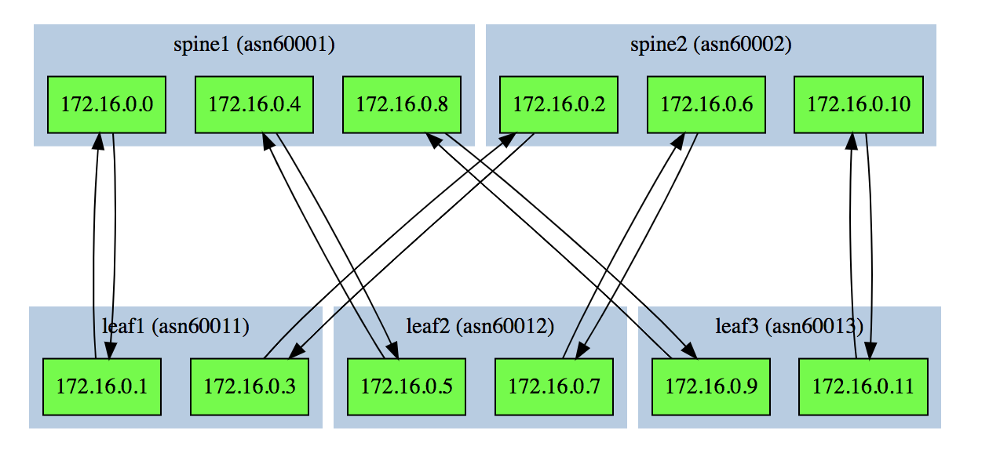
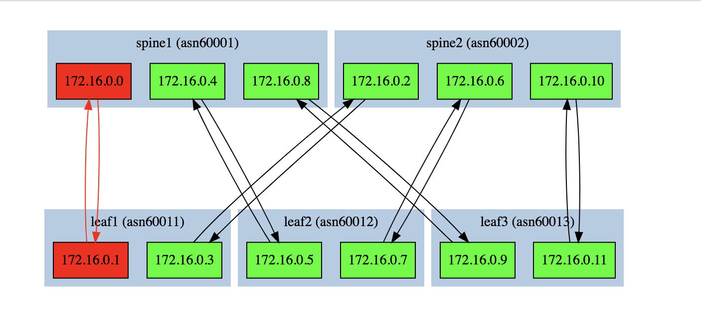

# Junos BGP Topology Discovery & Visualization Lab

## Summary

My goal in this exercise was to use `NAPALM` and `Nornir` to extract BGP state from the devices and use that BGP state to generate a web based visualization that showed BGP neighbor connections and state (up/down).  The lab is a simple 2 spine 3 leaf physical topology running on Juniper vQFX.

Technologies used to accomplish stated goal:

- `Python3`
- `NAPALM` - Handles device connections and BGP state extraction.
- `Nornir` - Handles multi-threaded automation orchastration.
- `Jinja2` - Renders the DOT node/edge output.
- [`d3-graphviz`](https://github.com/magjac/d3-graphviz) - used to render DOT format in web browser.


# Running the BGP state visualization tool

#### Bringing up lab topology
 For starters, you need to get the Junos lab running.  See [the Juniper Lab README.md](lab-provision/README.md).

 I can't say I documented the process to get the lab working perfectly, and it's only been tested on MacOS.

#### Generating and viewing BGP state 
 Once you have the Juniper lab running, run:
 ```
 python render_bgp_topology.py
 ```

This will generate a bgp_topology.html file, which contains some javascript libraries that can generate a simple web page from DOT input.

#### Viewing BGP State

Point your browswer to the local html file that was just rendered.

If all BGP neighbor are up, all nodes will be green.  If a neighbor is in the down state, the node will turn red and the edge will turn red.

Example with all BGP sessions up:



Now, if an interface is disabled, the rendered output will reflect a down BGP neighbor:



